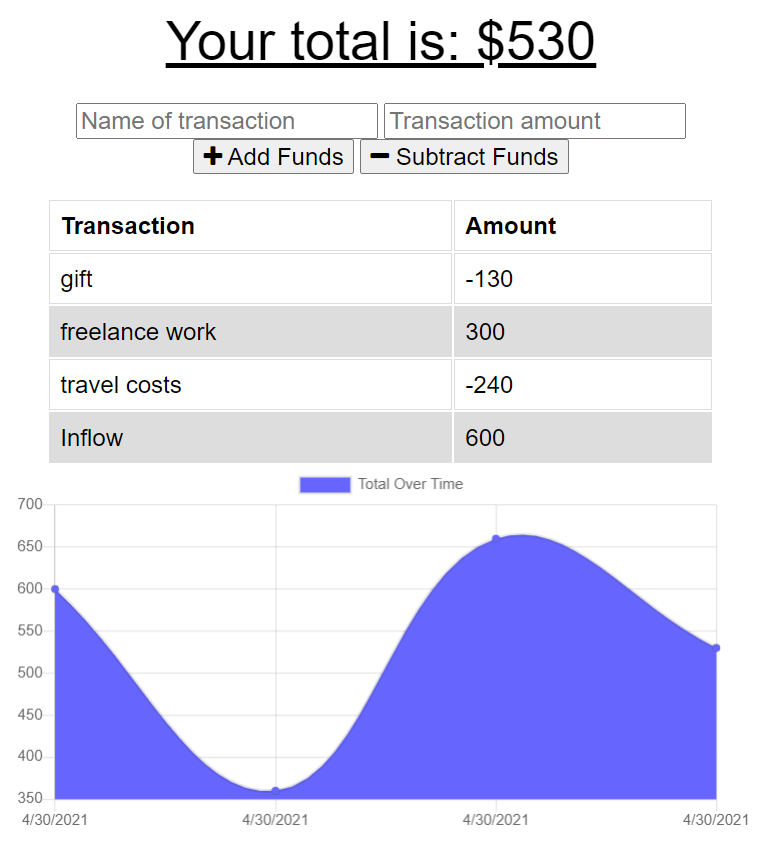

# Budget Tracker

## Description
The application is designed for users to enter inflows and outflows from their budget.

Table of Contents |
-------------------|
[Installation](#Installation)
[Usage](#Usage)
[Technologies](#Technologies)
[Screenshots](#Screenshots)
[Author](#Author)
[Contributing](#Contributing)
[Questions](#Questions)

 

## Installation

In order to run the project locally for development and testing, ensure that dependencies are installed by running:

`npm install` or `npm i`

 

## Usage

The application is a budget tracker, that takes in a description and amount entered by the user and posting it to the table displayed below the transaction log as either a deposit or withdrawal. The application is set up as a PWA and can be installed onto a device and can be used with low to no internet connectivity, with the application posting to the database when the connection is restored.

You can find the deployed link and the repository link below:

Deployed Link: [Deployed Link](https://vast-inlet-94560.herokuapp.com/)

Repo Link: [Repo Link](https://github.com/cerafinn/budget-tracker)

 

## Technologies

* Progressive Web Application, consisting of:
  * Service Worker
  * Manifest.json
* IndexedDB

 

## Screenshots

 

## Author

Created with ❤️ by Andaleeb Farooq

 

## Contributing

If interested in contributing to the project, feel free to reach out. Contact information can be found in the Questions section.

 

## Questions

If you have any questions or issues, feel free to reach out at: andaleeb.farooq@gmail.com.
You can also find more of my work on Github at [github link](https://github.com/cerafinn)